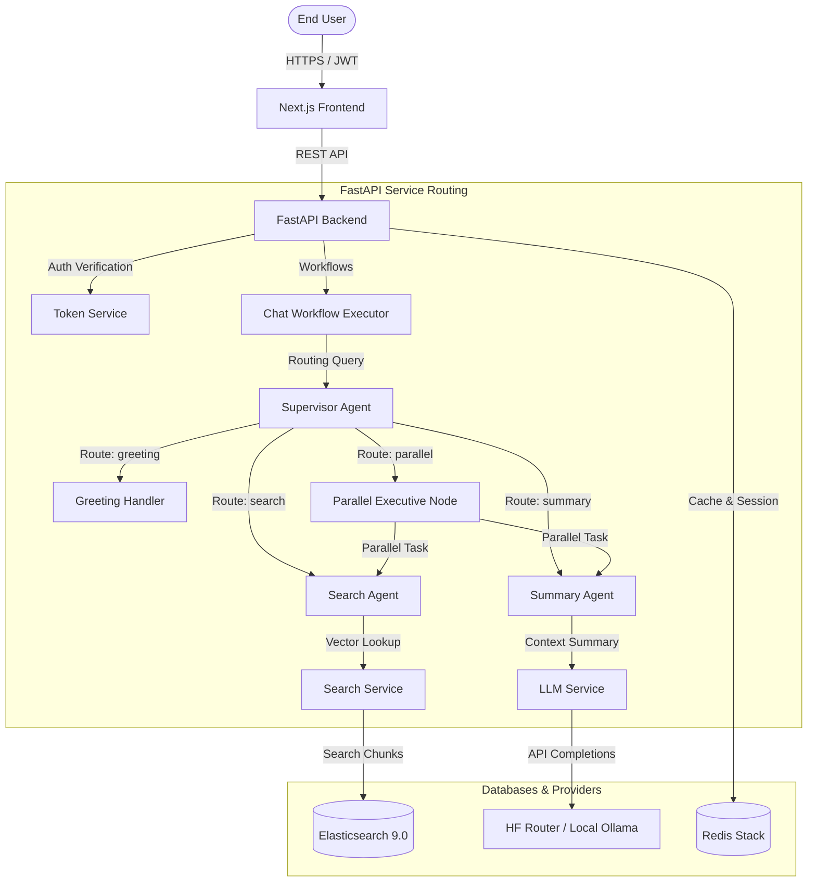

# Agentic AI Chat System

**A production-grade, multi-agent cooperative RAG platform that actually works.**

---

[](https://fastapi.tiangolo.com)
[](https://nextjs.org)
[](https://python.org)
[](https://nodejs.org)
[](https://www.docker.com)
[](LICENSE)

---

## 📖 1. Project Overview

The **Agentic AI Chat System** is an enterprise-ready Retrieval-Augmented Generation (RAG) system. Built around a dynamic multi-agent supervisor graph, it coordinates specialized micro-agents to resolve user requests.

### Why this project?
1. **Adaptive Query Execution**: Rather than using a static search-and-generate loop, the system routes queries through a **Supervisor Agent** to determine the optimal workflow (e.g., direct chat, fast search, deep summarization, or parallel operations).
2. **Mitigating Hallucinations**: Leverages grounded answer generation models that strictly synthesize output using source document context retrieved from a vector/inverted-index search engine.
3. **Resilient Local & Cloud Integrations**: Supports running light, free, and privacy-first local models (via Ollama) or scaling to powerful serverless inference backends (via Hugging Face Router API).

---

## 🚀 2. Features

### 1. Core AI & Agent Features
* **Supervisor Agent**: Employs hybrid routing—fast keyword parsing or precise LLM semantic analysis—to orchestrate tasks.
* **Parallel RAG Execution**: Runs Elasticsearch index searches and context summarization threads concurrently to lower response times.
* **Grounded Synthesis**: Guarantees source-attributed answers with exact page numbers and document names.

### 2. Security & Performance
* **JWT Identity Protection**: Secures routes with stateless token verification.
* **Token-Bucket Rate Limiting**: Prevents API abuse (default 60 req/minute).
* **Caching Layer**: Stores query results in Redis Stack to skip redundant LLM invocations.
* **Database Reconnection Resilience**: Resilient service clients that auto-reconnect to Redis and Elasticsearch if the databases restart.

---

## 🎨 3. Demo

| Interactive Console Dashboard |
| :---: | :---: |
|  |

---

## 📐 4. System Architecture

The following diagram details the flow of data from the frontend interface down to the micro-agents and databases:



---

## 🛠️ 5. Technology Stack

| Component | Selected Technology | Purpose |
| :--- | :--- | :--- |
| **Frontend** | Next.js 15, React 19, TypeScript, Tailwind CSS | Responsive dashboard console & client session handling. |
| **Backend** | FastAPI, Pydantic, Uvicorn | High-performance async ASGI gateway and router. |
| **Storage & Cache** | Redis Stack, Redis Insight | Message thread history, API caching, and GUI monitoring. |
| **Search Engine** | Elasticsearch 9.0 | High-fidelity vector search and text index store. |
| **AI Framework** | Hugging Face Router / Ollama API | Multi-model OpenAI spec inference wrapper. |
| **Observability** | Langfuse (Optional) | End-to-end LLM call tracing, evaluations, and latency logs. |

---

## 💻 6. Installation & Local Setup

### Step 1: Start Databases (Docker)
In your terminal, navigate to the root directory and start Redis and Elasticsearch:
```bash
docker compose up -d
# (Or "podman-compose up -d" if using Podman)
```
Verify the services are active:
* **Elasticsearch**: [http://localhost:9200](http://localhost:9200)
* **Redis Dashboard**: [http://localhost:8001](http://localhost:8001)

### Step 2: Configure & Run Backend (FastAPI)
> [!IMPORTANT]
> All Python and backend execution commands **MUST** be run strictly inside the activated virtual environment (`venv`).

1. Navigate to the backend directory:
   ```bash
   cd backend
   ```
2. Copy the environment template:
   ```bash
   copy .env.example .env
   # Or "cp .env.example .env" on Linux/macOS
   ```
3. Set your Hugging Face API key in `.env`:
   ```env
   HUGGINGFACE_API_KEY=hf_your_key_here
   ```
4. Create and activate a Python virtual environment:
   ```bash
   # Windows Command Prompt:
   python -m venv venv
   venv\Scripts\activate

   # Windows PowerShell:
   python -m venv venv
   .\venv\Scripts\Activate.ps1

   # Linux/macOS:
   python3 -m venv venv
   source venv/bin/activate
   ```
5. Install dependencies and start the server:
   ```bash
   pip install -r requirements.txt
   uvicorn app.main:app --reload --port 8000
   ```

### Step 3: Run Frontend (Next.js)
1. Open a new terminal tab/window and navigate to the frontend:
   ```bash
   cd frontend
   ```
2. Setup environment settings and install dependencies:
   ```bash
   copy .env.example .env.local
   # Or "cp .env.example .env.local" on Linux/macOS
   
   npm install
   ```
3. Start the NextJS development server:
   ```bash
   npm run dev
   ```
4. Access the workspace at: **[http://localhost:3000](http://localhost:3000)**

---

## 🔑 7. Environment Variables (`backend/.env`)

| Variable | Default Value | Description |
| :--- | :--- | :--- |
| `LLM_PROVIDER` | `huggingface` | AI completion gateway (`huggingface` or `ollama`). |
| `HUGGINGFACE_API_KEY` | `""` | Access Token with Serverless Inference API permissions. |
| `MODEL_SUMMARIZATION` | `deepseek-ai/DeepSeek-V4-Pro` | Model used for text summarization. |
| `MODEL_QUESTION_ANSWERING` | `Qwen/Qwen2.5-7B-Instruct` | Model used for grounded responses. |
| `REDIS_URL` | `redis://:redis_password@localhost:6379/0` | Connection URI for the Redis cache. |
| `ELASTICSEARCH_URL` | `http://localhost:9200` | Endpoint for the Elasticsearch index server. |

---

## 🌐 8. API Reference

| Endpoint | Method | Authentication | Description |
| :--- | :--- | :--- | :--- |
| `/health` | `GET` | None | Returns database connectivity status. |
| `/api/v1/auth/register` | `POST` | None | Registers a new user email and password. |
| `/api/v1/auth/login` | `POST` | None | Authenticates credentials and returns a JWT. |
| `/api/v1/ingest/batch` | `POST` | Bearer Token | Scans and indexes the `backend/data` files. |
| `/api/v1/chat` | `POST` | Bearer Token | Submits user message to the agent executor. |

---

## 🛡️ 9. Security & Threat Mitigation
1. **Rate Limiting**: Integrated token-bucket rate limiter intercepts requests on the FastAPI router to prevent DDoS attacks.
2. **Password Cryptography**: Passwords are securely hashed using `bcrypt` (salted iterations) inside the Auth service before storing.
3. **Strict CORS Guards**: Configured whitelist limits resource access solely to specified origins (e.g. `http://localhost:3000`).

---

## 🛠️ 10. Troubleshooting (FAQ)

### Q: Why is the `elastic` indicator offline in my dashboard?
1. The Elasticsearch docker container might not be fully started yet (takes $\approx30$ seconds to boot).
2. If it is running, verify that `ELASTICSEARCH_USER` and `ELASTICSEARCH_PASSWORD` are completely empty in your `.env` if local security is disabled.

### Q: I get a `403 Forbidden` error when sending messages.
Your Hugging Face Token lacks permissions. Generate a new token at [huggingface.co/settings/tokens](https://huggingface.co/settings/tokens) and check **"Make calls to the serverless Inference API"** under Fine-grained permissions (or use a classic **Read** token).

---

## 📜 11. License & Acknowledgments

This project is open-source and licensed under the [MIT License](LICENSE). 

Special thanks to the developers of **FastAPI**, **LangChain**, **Next.js**, **Hugging Face**, **Redis**, and **Elasticsearch** for providing the core building blocks of this agentic chat ecosystem.