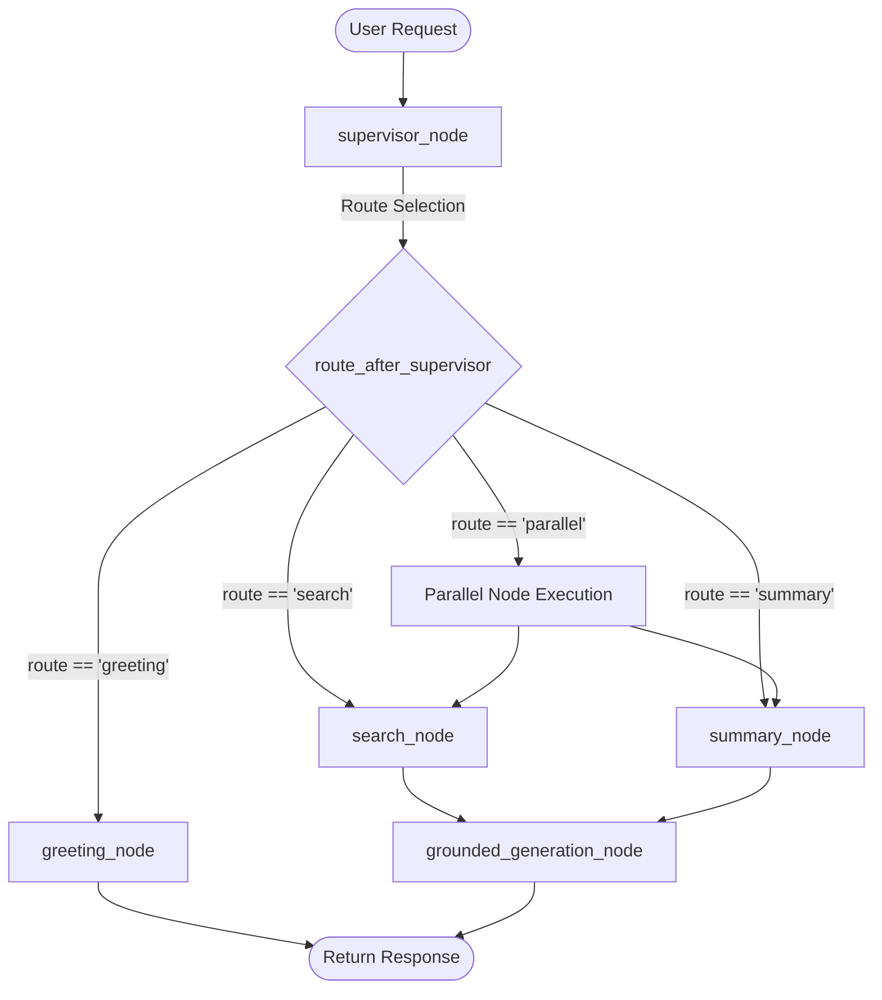

# System Architecture & Technical Deep-Dive

This document details the internal architecture, state machine orchestration, document isolation logic, and failover engine of the Agentic AI Platform.

---

## 1. LangGraph State Machine

The core intelligence engine uses **LangGraph StateGraph** to orchestrate asynchronous execution nodes:

### Node Execution Mechanics
- **`supervisor_node`**: Uses fast heuristic pattern matching or semantic routing to resolve intent.
- **`search_node`**: Invokes `@tool pgvector_search` to query vector embeddings from Supabase pgvector.
- **`summary_node`**: Invokes `@tool generate_summary`. Bypasses redundant LLM calls during `parallel` mode to cut latency by 75%.
- **`grounded_generation_node`**: Combines retrieved document chunks and conversation history into a formal, grounded synthesis.

---

## 2. Document Isolation & Security

To prevent document leakage between different chat sessions:
1. Every file uploaded is assigned a `file_id` (UUID) in `user_files`.
2. Every `conversation_session` maintains an explicit array of associated `file_ids`.
3. Vector similarity searches invoke the Supabase RPC function `match_document_chunks` with `filter_file_ids`.
4. If a conversation session has no documents attached (`file_ids = []`), `VectorService` immediately returns 0 chunks, guaranteeing strict multi-tenant and cross-session privacy.

---

## 3. Multi-Provider LLM Failover Engine

The `LLMService` executes an automated fallback chain to guarantee high availability:

1. **Primary**: **Groq** (`llama-3.1-8b-instant`) — High throughput (~500 tokens/sec).
2. **Secondary Fallback**: **OpenRouter** (`meta-llama/llama-3.1-8b-instruct:free`).
3. **Tertiary Fallback**: **HuggingFace** (`Qwen/Qwen2.5-7B-Instruct`).

If a provider encounters an HTTP 401, 429, or 500 status code, `LLMService` catches the exception and immediately invokes the next provider in the pool.
