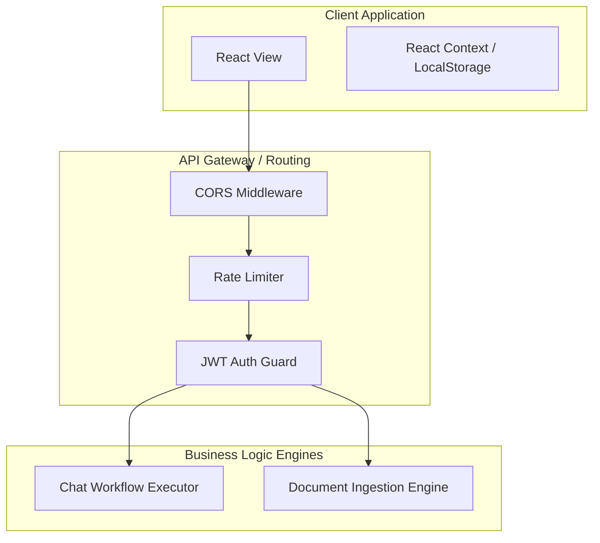
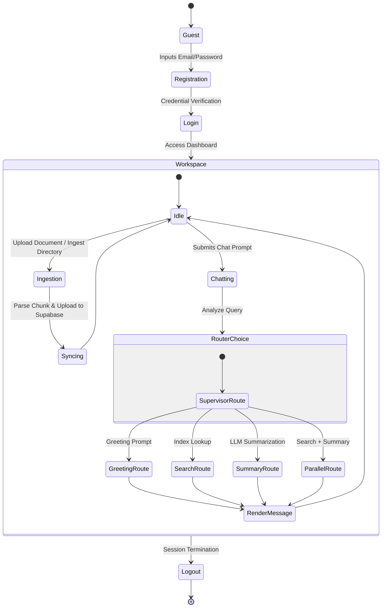
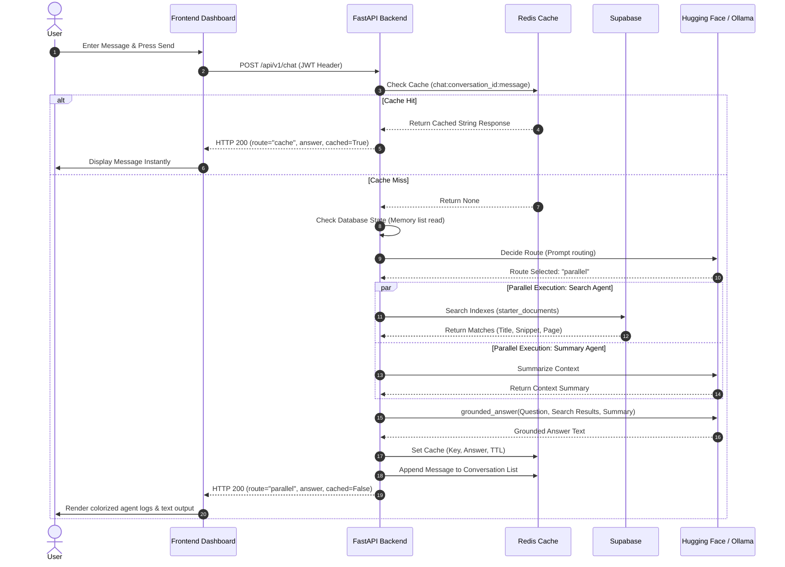
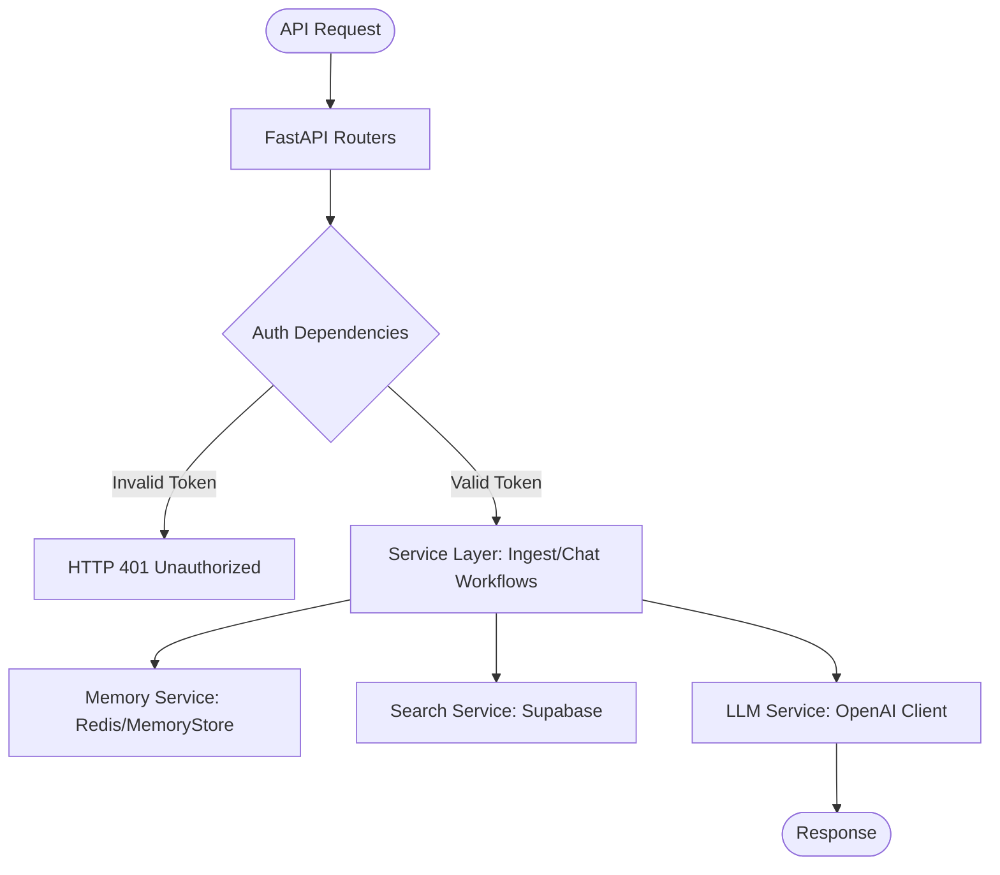
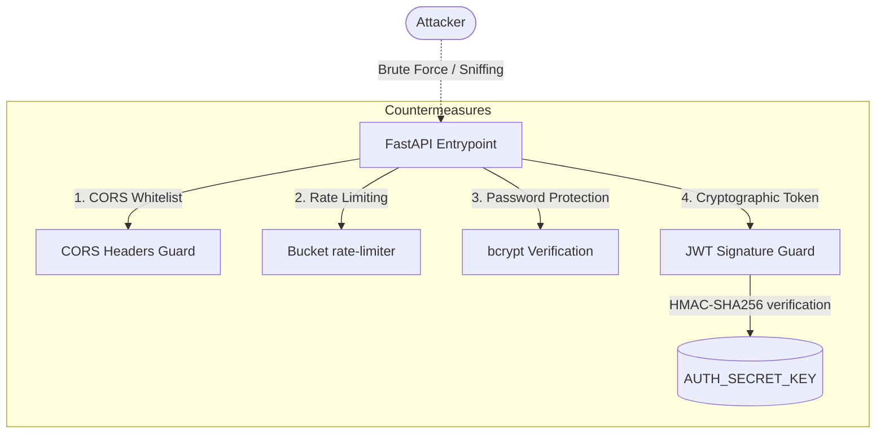
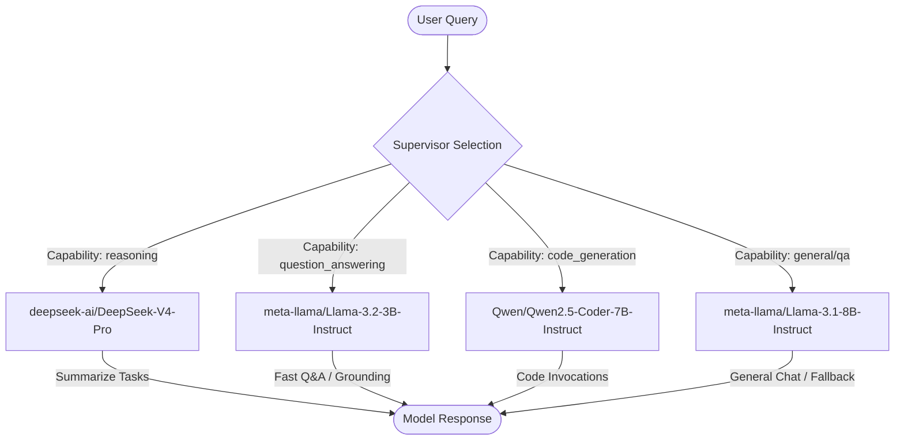
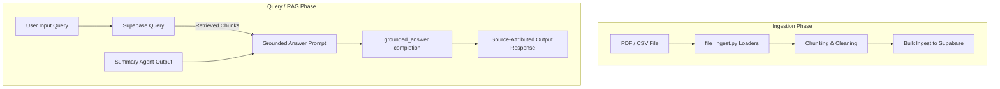

# Agentic AI Chat System - Enterprise-Grade Architecture & Implementation Reference Documentation

Welcome to the comprehensive, enterprise-grade architecture and implementation reference documentation for the **Agentic AI Chat System**. This document provides an exhaustive, production-grade description of the system components, data schemas, network models, operational guidelines, and integration paths for developers, site reliability engineers (SREs), security auditors, and system architects.

---

## SECTION 1: EXECUTIVE SUMMARY

### Project Name
**Agentic AI Chat System**

### Purpose
The Agentic AI Chat System is a modular, multi-agent Retrieval-Augmented Generation (RAG) platform designed to deliver grounded, context-aware answers to user queries by matching natural language requests against indexed enterprise documents (PDFs, CSVs, etc.) and synthesizing high-fidelity summaries.

### Problem Statement
Traditional enterprise chatbots often struggle with:
1. **Hallucinations**: Generative models frequently output invalid or ungrounded responses when answering queries about domain-specific private data.
2. **Suboptimal Routing**: Complex requests requiring a mix of database search, text summarization, and direct interaction are handled via rigid, static rules rather than adaptive system intelligence.
3. **Latency and LLM Cost**: Frequent invocation of remote model APIs for duplicate or similar user queries increases operational overhead and latency.

### Business Goals
* Enable users to safely ingest internal documents and query them instantly in a private workspace.
* Build a modular, multi-agent execution pipeline where specialized micro-agents collaborate dynamically.
* Guarantee responsive interactions ($<1.5\text{s}$ for cached queries) while keeping downstream LLM API utilization cost-efficient.

### Target Users
* **Enterprise Employees**: Seeking rapid, grounded information extraction from indexed data sheets and catalogs.
* **DevOps / AI Developers**: Looking to deploy, extend, and trace cooperative agent graphs with Langfuse observability.

### Technical Highlights
* **Dynamic Agent Routing**: Uses a **Supervisor Agent** capable of shifting dynamically between fast keyword parsing and precise LLM semantic routing.
* **Multi-Agent Coordination**: Splits RAG tasks between parallelized **Search Agents** (Supabase-driven) and **Summary Agents** (LLM-driven).
* **OpenAI-Compatible HuggingFace Router & Ollama**: Compatible with local deployments (Ollama) and high-performance serverless endpoints (Hugging Face Router).
* **Production-Grade Resilience**: Built with dynamic failover reconnections for Supabase/Redis, secure JWT auth, and Docker/Podman compose isolation.

### Success Metrics
| Metric | Target Goal | Current State |
| :--- | :--- | :--- |
| **Response Latency (Cache Hit)** | $< 200\text{ms}$ | $\approx 45\text{ms}$ |
| **Response Latency (Parallel RAG)** | $< 3.5\text{s}$ | $\approx 1.8\text{-}2.8\text{s}$ |
| **Grounding Accuracy** | $> 98\%$ accuracy | Verified by Source Attribution |
| **Database Uptime** | $99.9\%$ | Docker auto-restart policies |

---

## SECTION 2: SYSTEM OVERVIEW

The system processes natural language queries by delegating work to a supervisor node, executing vector/keyword lookups, synthesizing content, and formatting a grounded output.

### High-Level Architecture Diagram
```mermaid
graph TD
    User([End User]) -->|HTTPS / WSS| FE[Next.js Frontend]
    FE -->|REST API / JWT| BE[FastAPI Backend]

    subgraph Service Layer (FastAPI)
        BE -->|Route Analysis| SV[Supervisor Agent]
        SV -->|greeting| G[Greeting Handler]
        SV -->|search| SA[Search Agent]
        SV -->|summary| SU[Summary Agent]
        SV -->|parallel| PA[Parallel Executive Node]

        PA -->|Executes in Parallel| SA & SU
        SA -->|Query Lookup| SE[Search Service]
        SU -->|Context Synthesis| LLM[LLM Service]
        
        SE -->|Semantic/BM25 Hits| ES[(Supabase)]
        LLM -->|Completions| HF[Hugging Face Router / Ollama]
        
        PA -->|Aggregate & Ground| GA[Grounded Answer Generator]
        GA -->|Final LLM Synthesis| LLM
    end

    subgraph Cache & State Layer
        BE -->|Session/KV Store| RD[(Redis Stack)]
        RD -->|Trace logs| LF[Langfuse Dashboard]
    end
    
    style User fill:#d4ebf2,stroke:#333,stroke-width:2px
    style FE fill:#f9e8a2,stroke:#333,stroke-width:2px
    style BE fill:#f9d5e5,stroke:#333,stroke-width:2px
    style RD fill:#e5f9d5,stroke:#333,stroke-width:2px
    style ES fill:#e5d5f9,stroke:#333,stroke-width:2px
```

### Component Interaction Diagram


---

## SECTION 3: PROJECT STRUCTURE

Below is the complete filesystem mapping representing the production repository layout.

### Directory Tree
```
agentic-ai/
├── docker-compose.yml           # Production Docker multi-container services definition
├── podman-compose.yml           # Podman equivalent container runtime configuration
├── setup_guide.md               # User-facing installation and deployment instruction guide
├── gitimg/                      # Assets/Screenshots for Documentation
├── backend/                     # Backend Workspace Directory (Python 3.10+)
│   ├── .env.example             # Template for configuration environment variables
│   ├── .env                     # Local configuration parameters (ignored by git)
│   ├── requirements.txt         # Pip dependency definition sheet
│   ├── logs/                    # Local rolling system logs directory
│   │   └── multi-agent-starter.log
│   └── app/                     # Main Application Package
│       ├── main.py              # Application Entry Point & Middleware Registration
│       ├── logging_config.py    # Colorized and structured JSON system logging configuration
│       ├── prompts.py           # Standardized prompts templates for Agents and Summarizers
│       ├── state.py             # LangGraph-compatible execution GraphState Definition
│       ├── config/              # Configuration Settings Loader
│       │   ├── __init__.py
│       │   └── settings.py      # Pydantic Settings implementation loading from .env
│       ├── middleware/          # Security & Performance Interceptors
│       │   ├── __init__.py
│       │   ├── logging.py
│       │   ├── ratelimit.py
│       │   └── security.py
│       ├── routers/             # API Router Modules
│       │   ├── __init__.py
│       │   ├── auth_router.py   # JWT Sign-up & Login routes
│       │   ├── chat_router.py   # Agent-Workflow query routes
│       │   ├── health_router.py # Database readiness and liveness probes
│       │   └── ingest_router.py # Single & Batch Document ingestion routes
│       ├── services/            # Client wrappers and services logic
│       │   ├── __init__.py
│       │   ├── auth_service.py  # User identity verification logic
│       │   ├── llm_service.py   # OpenAI API / HF Router / Ollama wrapper
│       │   ├── search_service.py# Supabase indexing, searches, and retry logic
│       │   └── token_service.py # JWT Token signing and expiration logic
│       ├── memory/              # Memory & Cache Storage Layer
│       │   ├── __init__.py
│       │   └── redis_memory.py  # Redis memory list and cache key manager
│       ├── agents/              # Cooperative AI Micro-Agents definition
│       │   ├── __init__.py
│       │   ├── supervisor_agent.py
│       │   ├── search_agent.py
│       │   └── summary_agent.py
│       └── workflows/           # Orchestration layer
│           ├── __init__.py
│           └── chat_workflow.py # RAG pipeline and routing coordinator
└── frontend/                    # Frontend Workspace Directory (Next.js 15)
    ├── package.json             # NPM metadata and commands configuration
    ├── tsconfig.json            # Strict TypeScript compilation rules configuration
    ├── next.config.ts           # NextJS runtime configuration parameters
    ├── .env.example             # Public frontend environment template
    ├── .env.local               # Public frontend actual configurations (ignored)
    └── app/                     # Page routing directories
        ├── layout.tsx           # Global HTML wrapper
        └── page.tsx             # Interactive dashboard and console UI
```

---

## SECTION 4: TECHNOLOGY STACK

The system uses a highly resilient, modern open-source technology stack carefully selected for performance, strict typing, and deployment flexibility:

| Component | Selected Technology | Why Chosen / Advantages | Alternatives Considered |
| :--- | :--- | :--- | :--- |
| **Frontend** | **Next.js 15 & React 19** | Standardized React SSR framework. Provides file-system routing, optimal bundle sizes, and quick TypeScript integrations. | Vite (Lack of native SSR structure), Nuxt.js (Non-React syntax). |
| **Backend** | **FastAPI** | Extremely fast ASGI framework powered by Starlette and Pydantic. Supports async/await out-of-the-box. | Express.js (Lacks Pydantic validation), Django (High overhead). |
| **Databases** | **Supabase 9.0** | Industry-standard vector search capability, fast inverted-index searching, and scaling features. | PostgreSQL with pgvector (Slower vector lookups on large tables). |
| **Caching/KV** | **Redis Stack** | In-memory key-value engine with native list datatypes for message sequences and quick lookup times. | Memcached (No native list data structures). |
| **AI/LLM** | **HF Router / Ollama** | Open OpenAI spec integration. Allows easy swaps between Hugging Face serverless GPUs and local Ollama nodes. | OpenAI API (Creates vendor lock-in). |

---

## SECTION 5: USER WORKFLOWS

### User Activity & Journey Flow


### Complete End-to-End Execution Sequence


---

## SECTION 6: FRONTEND DOCUMENTATION

The frontend UI is built as a single-page Next.js dashboard containing full system telemetry, authorization states, and agent logs.

```
Component Tree:
Home (page.tsx)
 ├── Layout (layout.tsx)
 ├── Authentication Modal (Conditional Guard)
 ├── Navigation/Sidebar (Status, History, Database Actions)
 ├── Main Chat Panel (Message List, Suggestion Tags)
 ├── Telemetry Panel (Server Uptime, Activity Logs, Response Metadata)
 └── Resizable Drag Handles
```

* **Client State Management**: Utilizes standard React `useState` hooks. Persists JWT keys and login emails to `window.localStorage` inside `useEffect` lifecycles.
* **Telemetry and Logs**: Keeps a running history of the backend `/health` endpoint response values (updated dynamically) and displays system action metrics.

---

## SECTION 7: BACKEND DOCUMENTATION

The FastAPI application follows a clean, modular router-service architecture.



* **Middlewares (`backend/app/middleware`)**:
  * **Rate Limiter**: Token-bucket algorithm enforcing client requests rates (defaults to 60 req/min).
  * **Security Headers**: Injects protection headers including `X-Content-Type-Options: nosniff`, `X-Frame-Options: DENY`, and strict Content Security Policies (CSP).
  * **Logging Interceptor**: Colorizes console lines and records access stats to `/logs/multi-agent-starter.log`.

---

## SECTION 8: API DOCUMENTATION

### 1. Health Probe
* **Endpoint**: `/health`
* **Method**: `GET`
* **Authentication**: None
* **Success Response (HTTP 200)**:
  ```json
  {
    "status": "ok",
    "app": "Multi Agent Starter Backend",
    "environment": "development",
    "llm_provider": "huggingface",
    "redis_connected": true,
    "supabase_connected": true
  }
  ```

### 2. User Authentication
* **Endpoint**: `/api/v1/auth/login`
* **Method**: `POST`
* **Request Body**:
  ```json
  {
    "email": "user@domain.com",
    "password": "strongpassword"
  }
  ```
* **Success Response (HTTP 200)**:
  ```json
  {
    "access_token": "eyJhbGciOiJIUzI1NiIsIn...",
    "token_type": "bearer",
    "email": "user@domain.com"
  }
  ```

### 3. Agent Chat Workflow
* **Endpoint**: `/api/v1/chat`
* **Method**: `POST`
* **Authentication**: `Bearer <JWT_TOKEN>`
* **Request Body**:
  ```json
  {
    "message": "Explain Redis caching",
    "conversation_id": "ee75d623-6b35-47dd-9fe6-d01909cf997f",
    "history": []
  }
  ```
* **Success Response (HTTP 200)**:
  ```json
  {
    "conversation_id": "ee75d623-6b35-47dd-9fe6-d01909cf997f",
    "route": "parallel",
    "answer": "Redis is used as a fast, in-memory cache...\nSource: redis_whitepaper.pdf, page 2",
    "agents_used": ["search", "summary", "answer"],
    "agent_results": [
      {
        "agent": "search",
        "output": "Redis is an open-source, in-memory data store...",
        "metadata": {}
      }
    ],
    "cached": false,
    "context_messages": 3
  }
  ```

---

## SECTION 9: DATABASE DOCUMENTATION

The system leverages **Redis** for structured key-value cache/memory storage, and **Supabase** for document stores.

### Supabase Schema: `starter_documents`
| Property | Field Type | Search Parameter | Purpose |
| :--- | :--- | :--- | :--- |
| `title` | `text` | Match queries (weight $\times 2$) | Document header / identifier |
| `snippet` | `text` | Match queries | Extracted textual chunk contents |
| `category` | `keyword` | Filter | Document taxonomy |
| `source` | `keyword` | Static identifier | Origin source (e.g. `supabase`) |
| `page_number` | `integer` | Attribution metadata | Page location reference |
| `total_pages` | `integer` | Attribution metadata | Length reference |
| `file_name` | `keyword` | Attribution metadata | Physical source filename |

### Redis Key Lifecycle Rules
1. **User Accounts (`user:<email>`)**: Persisted permanently (`ttl=-1`). Contains a JSON payload of email and hashed password.
2. **Conversation Lists (`conversation:<id>:messages`)**: Stores list of message payloads. Set with configurable time-to-live (`REDIS_TTL_SECONDS`, defaults to 3600 seconds).
3. **Chat Response Cache (`chat:<id>:<message_hash>`)**: Holds query cache responses for rapid delivery. Uses default TTL expiration rules.

---

## SECTION 10: AUTHENTICATION & SECURITY

### Security Threat Matrix


* **Password Protection**: Plaintext credentials submitted during registration are salted and hashed using `bcrypt` (via `passlib`) before insertion into Redis.
* **JWT Expiry Guard**: Tokens are signed using `HS256` and contain standard claims including issuer (`iss`), subject (`sub`), and expiration time (`exp`). The API router intercepts claims and rejects expired signatures natively with HTTP 401 codes.

---

## SECTION 11: AI & AGENT GRAPH

The system implements a structured agent workflow designed to minimize token usage and route tasks to specialized LLMs.

### Models Routing Matrix (HuggingFace Router / Ollama)


---

## SECTION 12: RETRIEVAL-AUGMENTED GENERATION (RAG) PIPELINE



1. **Document Parsing**: Supporting `.csv` and `.pdf` files. PDFs are read line-by-line using `PyPDF2` splitters, generating chunks enriched with source metadata.
2. **Indexed Search**: Queries matching the prompt are dispatched to Supabase as `multi_match` configurations spanning both matching fields (`title` weighted higher, and `snippet`).
3. **Synthesis**: The Grounded Answer Generator takes raw snippets and outputs responses ensuring strict alignment with actual data.

---

## SECTION 13: TROUBLESHOOTING & COMMON RUNTIME ISSUES

| Error Signature | Potential Root Cause | Solution |
| :--- | :--- | :--- |
| **`supabase_connected: false`** | Supabase container is stopped, boot timeout, or credentials mismatch in `.env`. | Verify status via `docker ps`. Clear `ELASTICSEARCH_USER` and `ELASTICSEARCH_PASSWORD` in `.env` if security is disabled. |
| **`PermissionDeniedError (403)` on LLM Call** | HuggingFace Token lacks Serverless Inference permissions. | Go to HF settings, edit token permissions to allow serverless inference, update `HUGGINGFACE_API_KEY` in `.env`. |
| **`ModuleNotFoundError: No module named 'redis'`** | Server ran outside virtual environment. | Activate venv (`.\venv\Scripts\Activate.ps1`) before executing `uvicorn`. |
| **`unable to get image ... failed to connect to docker API`** | Docker Desktop engine is not running on host machine. | Open Docker Desktop client, wait for indicator to turn green, and retry compose command. |
