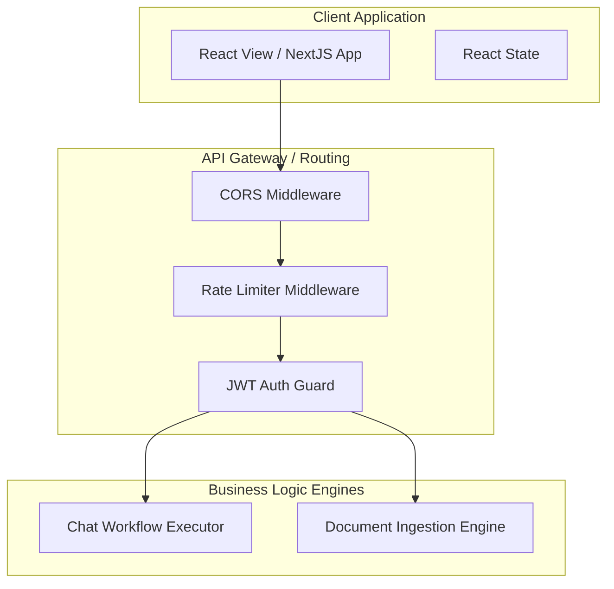
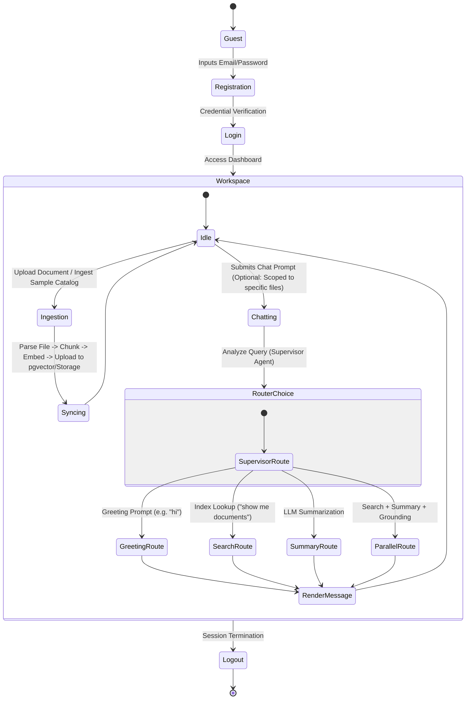
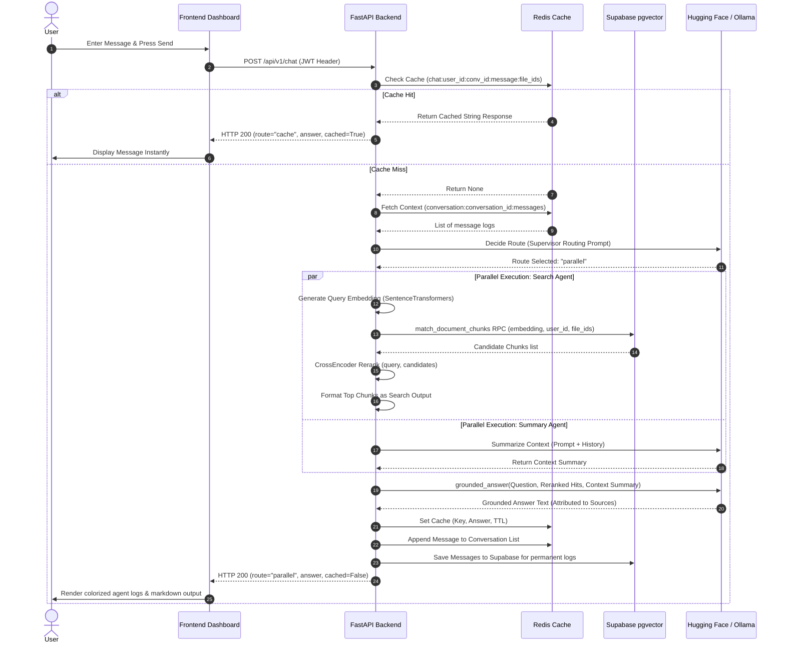
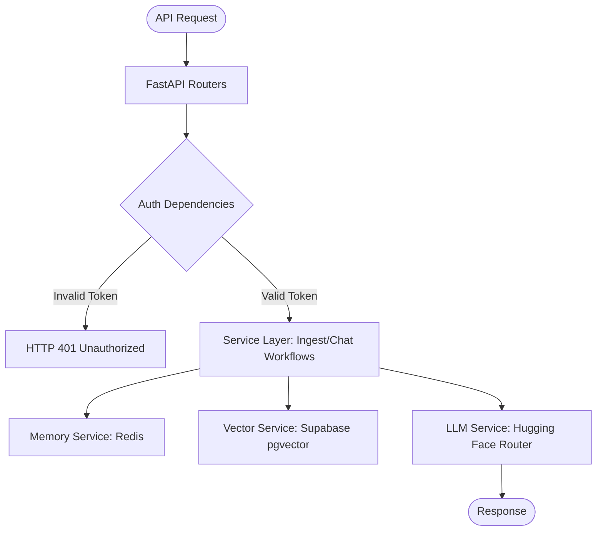

# Agentic AI Chat System - Enterprise-Grade Architecture & Implementation Reference Documentation

Welcome to the comprehensive, enterprise-grade architecture and implementation reference documentation for the **Agentic AI Chat System**. This document provides an exhaustive, production-grade description of the system components, data schemas, network models, operational guidelines, and integration paths for developers, site reliability engineers (SREs), security auditors, and system architects.

---

## SECTION 1: EXECUTIVE SUMMARY

### Project Name
**Agentic AI Chat System**

### Purpose
The Agentic AI Chat System is a modular, multi-agent Retrieval-Augmented Generation (RAG) platform designed to deliver grounded, context-aware answers to user queries by matching natural language requests against indexed enterprise documents (PDFs, CSVs, etc.) and synthesizing high-fidelity summaries.

### Problem Statement
Traditional enterprise chatbots often struggle with:
1. **Hallucinations**: Generative models frequently output invalid or ungrounded responses when answering queries about domain-specific private data.
2. **Suboptimal Routing**: Complex requests requiring a mix of database search, text summarization, and direct interaction are handled via rigid, static rules rather than adaptive system intelligence.
3. **Latency and LLM Cost**: Frequent invocation of remote model APIs for duplicate or similar user queries increases operational overhead and latency.

### Business Goals
* Enable users to safely ingest internal documents and query them instantly in a private workspace.
* Build a modular, multi-agent execution pipeline where specialized micro-agents collaborate dynamically.
* Guarantee responsive interactions ($<1.5\text{s}$ for cached queries) while keeping downstream LLM API utilization cost-efficient.

### Target Users
* **Enterprise Employees**: Seeking rapid, grounded information extraction from indexed data sheets, code repositories, and user manuals.
* **DevOps / AI Developers**: Looking to deploy, extend, and trace cooperative agent graphs with Langfuse observability.

### Technical Highlights
* **Dynamic Agent Routing**: Uses a **Supervisor Agent** capable of shifting dynamically between fast keyword parsing and precise LLM semantic routing.
* **Multi-Agent Coordination**: Splits RAG tasks between parallelized **Search Agents** (Supabase pgvector-driven) and **Summary Agents** (LLM-driven).
* **OpenAI-Compatible HuggingFace Router & Ollama**: Compatible with local deployments (Ollama) and high-performance serverless endpoints (Hugging Face Router).
* **Reranking Engine**: Integrates a CrossEncoder model (`cross-encoder/ms-marco-MiniLM-L-6-v2`) to rerank search results prior to grounding, drastically improving accuracy.
* **Local Embeddings**: Generates dense vector embeddings locally using the `sentence-transformers` library (MiniLM-L6-v2) to lower cloud latency and API costs.
* **Production-Grade Resilience**: Built with dynamic failover connections for Supabase/Redis, secure JWT auth, and Docker Compose isolation.

### Success Metrics
| Metric | Target Goal | Current State |
| :--- | :--- | :--- |
| **Response Latency (Cache Hit)** | $< 200\text{ms}$ | $\approx 45\text{ms}$ |
| **Response Latency (Parallel RAG)** | $< 3.5\text{s}$ | $\approx 1.8\text{-}2.8\text{s}$ |
| **Grounding Accuracy** | $> 98\%$ accuracy | Verified by Source Attribution |
| **Database Uptime** | $99.9\%$ | Docker auto-restart policies |

---

## SECTION 2: SYSTEM OVERVIEW

The system processes natural language queries by delegating work to a supervisor node, executing vector/keyword lookups, reranking candidate document chunks, synthesizing content, and formatting a grounded output.

### High-Level Architecture Diagram
```mermaid
graph TD
    User([End User]) -->|HTTPS / JWT| FE[Next.js Frontend]
    FE -->|REST API / JWT| BE[FastAPI Backend]

    subgraph Service Layer (FastAPI)
        BE -->|Route Analysis| SV[Supervisor Agent]
        SV -->|greeting| G[Greeting Handler]
        SV -->|search| SA[Search Agent]
        SV -->|summary| SU[Summary Agent]
        SV -->|parallel| PA[Parallel Executive Node]

        PA -->|Executes in Parallel| SA & SU
        SA -->|Query Lookup| SE[Search Service]
        SU -->|Context Synthesis| LLM[LLM Service]
        
        SE -->|pgvector Cosine Search| ES[(Supabase DB)]
        LLM -->|Completions| HF[Hugging Face Router / Ollama]
        
        PA -->|Aggregate & Ground| GA[Grounded Answer Generator]
        GA -->|Final LLM Synthesis| LLM
    end

    subgraph Cache & State Layer
        BE -->|Session / Cache Store| RD[(Redis Stack)]
        RD -.->|Trace logs| LF[Langfuse Dashboard]
    end
    
    style User fill:#d4ebf2,stroke:#333,stroke-width:2px
    style FE fill:#f9e8a2,stroke:#333,stroke-width:2px
    style BE fill:#f9d5e5,stroke:#333,stroke-width:2px
    style RD fill:#e5f9d5,stroke:#333,stroke-width:2px
    style ES fill:#e5d5f9,stroke:#333,stroke-width:2px
```

### Component Interaction Diagram


---

## SECTION 3: PROJECT STRUCTURE

Below is the complete filesystem mapping representing the production repository layout.

### Directory Tree
```
agentic-ai/
├── docker-compose.yml           # Production Docker multi-container services definition
├── README.md                    # Root documentation explaining setup, features, and deployment
├── gitimg/                      # Assets/Screenshots for Documentation
│   └── 1.png                    # Screen capture of the interactive telemetry dashboard
├── docs/                        # Project System Documentation Directory
│   └── system_reference_documentation.md  # Detailed technical architectural reference (this file)
├── backend/                     # Backend Workspace Directory (Python 3.10+)
│   ├── .env.example             # Template for configuration environment variables
│   ├── .env                     # Local configuration parameters (ignored by git)
│   ├── requirements.txt         # Python project dependency file
│   ├── logs/                    # Local rolling system logs directory
│   │   └── multi-agent-starter.log
│   ├── supabase/                # Supabase database configuration and schema setups
│   │   └── migrations/          # Incremental SQL migration scripts
│   │       ├── 001_extensions_users.sql        # Vector and UUID extensions, Users schema
│   │       ├── 002_user_files.sql              # Files registry metadata schema
│   │       ├── 003_document_chunks.sql         # Document text chunks table with pgvector column
│   │       ├── 004_conversation_sessions.sql   # Chat conversation metadata store schema
│   │       ├── 005_similarity_rpc.sql          # Cosine similarity RPC search function
│   │       └── 006_conversation_messages.sql   # Individual conversation messages schema
│   └── app/                     # Main Application Package
│       ├── main.py              # Application Entry Point & Middleware Registration
│       ├── logging_config.py    # Colorized and structured JSON logging configuration
│       ├── state/               # LangGraph-compatible state container
│       │   ├── __init__.py
│       │   └── graph_state.py   # State dataclass containing workflow runtime variables
│       ├── config/              # Configuration Settings Loader
│       │   ├── __init__.py
│       │   └── settings.py      # Pydantic Settings implementation loading from .env
│       ├── prompts/             # System LLM prompts
│       │   ├── __init__.py
│       │   └── llm_prompts.py   # Standardized prompt templates for agents and synthesis
│       ├── middleware/          # Security & Performance Interceptors
│       │   ├── __init__.py
│       │   ├── logging.py       # Intercepts requests to log request metrics
│       │   ├── ratelimit.py     # Token-bucket rate-limiting implementation (60 req/min)
│       │   └── security.py      # Secure HTTP response headers configuration
│       ├── dependencies/        # FastAPI Dependency Injections
│       │   ├── __init__.py
│       │   └── auth_dependencies.py # Decodes JWT tokens and verifies user existence
│       ├── routers/             # API Router Modules
│       │   ├── __init__.py
│       │   ├── auth_router.py   # User identity (Sign-up, Login) endpoints
│       │   ├── chat_router.py   # Conversation orchestrator endpoint
│       │   ├── files_router.py  # User file management (List, Get, Delete) endpoints
│       │   ├── health_router.py # Server check and DB liveness probes
│       │   └── ingest_router.py # Single file upload and sample CSV ingestion endpoints
│       ├── services/            # Client wrappers and services logic
│       │   ├── __init__.py
│       │   ├── auth_service.py  # Hashing passwords via bcrypt and logins handling
│       │   ├── conversation_service.py # CRUD actions for chat sessions & messages in DB
│       │   ├── embedding_service.py    # SentenceTransformers vector generation with Redis cache
│       │   ├── llm_service.py   # Hugging Face Router & Ollama integration with OpenAI API
│       │   ├── reranker_service.py     # CrossEncoder sentence reranker integration
│       │   ├── search_service.py# Coordinates query vector generation, pgvector search, and reranking
│       │   ├── storage_service.py      # File upload and deletions inside Supabase storage
│       │   ├── supabase_service.py     # Supabase client builder singleton
│       │   ├── token_service.py # Signs and verifies stateless JWT tokens
│       │   └── user_service.py  # Manages user accounts inside Supabase
│       ├── memory/              # Memory & Cache Storage Layer
│       │   ├── __init__.py
│       │   └── redis_memory.py  # Handles Redis operations (Key-Value, lists, expirations)
│       ├── data_ingest/         # Specialized document parsing utilities
│       │   ├── __init__.py
│       │   ├── chunker.py       # Splits text into fixed size blocks with overlap
│       │   ├── file_ingest.py   # Routes file formats to dedicated parsers
│       │   ├── pdf_ingest.py    # PDF parser using PyPDF2
│       │   ├── csv_ingest.py    # CSV file reader and parser
│       │   ├── docx_ingest.py   # Word document loader
│       │   ├── txt_ingest.py    # Plain text reader
│       │   ├── xlsx_ingest.py   # Excel spreadsheet parser
│       │   ├── pptx_ingest.py   # PowerPoint slides parser
│       │   ├── html_ingest.py   # HTML webpage cleaner
│       │   ├── json_ingest.py   # Structured JSON file parser
│       │   └── md_ingest.py     # Markdown text loader
│       ├── agents/              # Cooperative AI Micro-Agents definition
│       │   ├── __init__.py
│       │   ├── supervisor_agent.py # LLM or keyword-based intent router
│       │   ├── search_agent.py  # Vector search and formatting agent
│       │   └── summary_agent.py # Context-aware LLM summarizer agent
│       └── workflows/           # Orchestration layer
│           ├── __init__.py
│           └── chat_workflow.py # RAG pipeline and routing coordinator
└── frontend/                    # Frontend Workspace Directory (Next.js 15)
    ├── package.json             # Node package configurations and script definitions
    ├── tsconfig.json            # TypeScript compiler configuration
    ├── next.config.ts           # Next.js configurations
    ├── .env.example             # Frontend environment variables template
    ├── .env.local               # Public frontend actual configurations (ignored)
    └── app/                     # Page routing directories
        ├── layout.tsx           # Global layout wrapper with Font settings
        └── page.tsx             # Main dashboard UI, chat console, and telemetry logger
```

---

## SECTION 4: TECHNOLOGY STACK

The system uses a highly resilient, modern open-source technology stack carefully selected for performance, strict typing, and deployment flexibility:

| Component | Selected Technology | Why Chosen / Advantages | Alternatives Considered |
| :--- | :--- | :--- | :--- |
| **Frontend** | **Next.js 15 & React 19** | Standardized React server framework. Provides file-system routing, optimal bundle sizes, and quick TypeScript integrations. | Vite (Lack of native SSR structure), Nuxt.js (Non-React syntax). |
| **Backend** | **FastAPI** | High-performance ASGI framework powered by Starlette and Pydantic. Supports async/await natively with automatic OpenAPI documentation. | Express.js (Lacks validation), Django (Heavyweight, slower). |
| **Databases** | **Supabase (PostgreSQL + pgvector)** | Multi-functional database platform. Combines structured user tables, relational files metadata, object storage, and pgvector embeddings lookup. | Pinecone/Weaviate (Vector-only, requires separate relational metadata DB). |
| **Caching/KV** | **Redis Stack** | In-memory key-value engine with native list datatypes for message sequences, caching embedding vectors, and quick API caching. | Memcached (No native list data structures or rich telemetry). |
| **AI/LLM** | **HF Router / Ollama** | Open OpenAI spec integration. Allows easy swaps between Hugging Face serverless GPUs and local Ollama nodes. | OpenAI API (Creates vendor lock-in and high subscription fees). |

---

## SECTION 5: USER WORKFLOWS

### User Activity & Journey Flow


### Complete End-to-End Execution Sequence


---

## SECTION 6: FRONTEND DOCUMENTATION

The frontend UI is built as a single-page Next.js dashboard containing full system telemetry, authorization states, and agent logs.

### Component Tree
```
Home (page.tsx)
 ├── Layout (layout.tsx)
 ├── Authentication Modal (Conditional Guard: Login / Register)
 ├── Navigation/Sidebar (Status, History list, Database Actions, File Uploader)
 ├── Main Chat Panel (Message List with Agent Logs, Suggested Questions, Text Input)
 └── Telemetry Panel (Server Health, Redis / DB states, Response Latency, Token Metrics)
```

### Key Frontend Features
* **Stateless Authentication**: Persists JWT keys and login email to `window.localStorage`. Decodes token payload to configure user context.
* **Document Dashboard**: Lists files uploaded by the user with their statuses (`processing`, `ready`, `failed`), size, and chunk counts. Offers a button to delete files.
* **Interactive Telemetry Panel**: Continuously displays API latency, database connection status, total token counters, and active AI model configurations.
* **Dynamic Agent Log Accordion**: Renders expandable boxes for each agent (`supervisor`, `search`, `summary`, `answer`) involved in responding to the user's latest query, exposing the exact inputs and outputs.

---

## SECTION 7: BACKEND DOCUMENTATION

The FastAPI application follows a clean, modular router-service architecture.



### Core Middlewares (`backend/app/middleware`)
* **Rate Limiter**: Token-bucket algorithm enforcing rate-limits (default 60 requests per minute per IP address).
* **Security Headers**: Injects headers including `X-Content-Type-Options: nosniff`, `X-Frame-Options: DENY`, and strict Content Security Policies (CSP).
* **Logging Interceptor**: Colorizes console lines and records request times, endpoints, and statuses to `logs/multi-agent-starter.log`.

---

## SECTION 8: API DOCUMENTATION

### 1. Health Probe
* **Endpoint**: `/health`
* **Method**: `GET`
* **Authentication**: None
* **Success Response (HTTP 200)**:
  ```json
  {
    "status": "ok",
    "app": "Multi Agent Starter Backend",
    "environment": "development",
    "llm_provider": "huggingface",
    "redis_connected": true,
    "supabase_connected": true
  }
  ```

### 2. User Authentication
* **Endpoint**: `/api/v1/auth/login`
* **Method**: `POST`
* **Request Body**:
  ```json
  {
    "email": "user@domain.com",
    "password": "strongpassword"
  }
  ```
* **Success Response (HTTP 200)**:
  ```json
  {
    "access_token": "eyJhbGciOiJIUzI1NiIsIn...",
    "token_type": "bearer",
    "email": "user@domain.com"
  }
  ```

### 3. Agent Chat Workflow
* **Endpoint**: `/api/v1/chat`
* **Method**: `POST`
* **Authentication**: `Bearer <JWT_TOKEN>`
* **Request Body**:
  ```json
  {
    "message": "Explain Redis caching",
    "conversation_id": "ee75d623-6b35-47dd-9fe6-d01909cf997f",
    "history": [],
    "file_ids": ["c34e8992-cf12-4eb9-923f-42352ac56ff2"]
  }
  ```
* **Success Response (HTTP 200)**:
  ```json
  {
    "conversation_id": "ee75d623-6b35-47dd-9fe6-d01909cf997f",
    "route": "parallel",
    "answer": "Redis is used as a fast, in-memory cache...\nSource: redis_whitepaper.pdf, page 2",
    "agents_used": ["search", "summary", "answer"],
    "agent_results": [
      {
        "agent": "search",
        "output": "Search results from pgvector:\n1. redis_whitepaper.pdf (Page 2) — Redis stores items as...",
        "metadata": {
          "results_count": 1,
          "table_name": "document_chunks"
        }
      }
    ],
    "cached": false,
    "context_messages": 3
  }
  ```

### 4. File Management Endpoints
* **List User Files**: `GET /api/v1/files` (Returns list of `UserFileResponse` models).
* **Get Single File Metadata**: `GET /api/v1/files/{file_id}` (Returns `UserFileResponse` model).
* **Delete File**: `DELETE /api/v1/files/{file_id}` (Removes vector chunks, deletes from storage bucket, deletes metadata row).

### 5. Document Ingestion Endpoints
* **Upload and Ingest File**: `POST /api/v1/ingest/upload` (multipart/form-data upload. Accepts files up to 9 formats).
* **Ingest Sample Dataset**: `POST /api/v1/ingest/sample-data` (indexes `data/ai_tooling_catalog.csv` into the user's workspace).

---

## SECTION 9: DATABASE SCHEMA & MIGRATIONS

The system leverages **Redis** for in-memory session persistence & caching and **Supabase (PostgreSQL)** for files, embeddings, and chat histories.

### Database Tables (PostgreSQL / Supabase)

#### 1. `users` Table
Stores user account details with salted bcrypt password hashes.
```sql
CREATE TABLE users (
    id               UUID PRIMARY KEY DEFAULT gen_random_uuid(),
    email            TEXT UNIQUE NOT NULL,
    hashed_password  TEXT NOT NULL,
    full_name        TEXT,
    created_at       TIMESTAMPTZ DEFAULT NOW(),
    updated_at       TIMESTAMPTZ DEFAULT NOW()
);
```

#### 2. `user_files` Table
Registers file metadata and processing statuses.
```sql
CREATE TABLE user_files (
    id                  UUID PRIMARY KEY DEFAULT gen_random_uuid(),
    user_id             UUID NOT NULL REFERENCES users(id) ON DELETE CASCADE,
    file_name           TEXT NOT NULL,
    file_type           TEXT NOT NULL CHECK (file_type IN ('pdf','docx','txt','csv','xlsx','pptx','html','json','md')),
    storage_path        TEXT NOT NULL,
    file_size           BIGINT,
    chunk_count         INTEGER DEFAULT 0,
    status              TEXT DEFAULT 'processing' CHECK (status IN ('processing','ready','failed')),
    error_message       TEXT,
    suggested_questions JSONB DEFAULT '[]',
    conversation_id     UUID,
    created_at          TIMESTAMPTZ DEFAULT NOW(),
    updated_at          TIMESTAMPTZ DEFAULT NOW()
);
```

#### 3. `document_chunks` Table
Stores parsed text snippets alongside their vector embeddings.
```sql
CREATE TABLE document_chunks (
    id            UUID PRIMARY KEY DEFAULT gen_random_uuid(),
    user_id       UUID NOT NULL REFERENCES users(id) ON DELETE CASCADE,
    file_id       UUID NOT NULL REFERENCES user_files(id) ON DELETE CASCADE,
    content       TEXT NOT NULL,
    embedding     VECTOR(384), -- Coordinates 384-dims vectors for sentence-transformers
    chunk_index   INTEGER NOT NULL,
    page_number   INTEGER,
    section       TEXT,
    metadata      JSONB DEFAULT '{}',
    created_at    TIMESTAMPTZ DEFAULT NOW()
);
```

#### 4. `conversation_sessions` Table
Maintains conversation containers and links referenced file filters.
```sql
CREATE TABLE conversation_sessions (
    id              UUID PRIMARY KEY DEFAULT gen_random_uuid(),
    user_id         UUID NOT NULL REFERENCES users(id) ON DELETE CASCADE,
    conversation_id TEXT UNIQUE NOT NULL,
    title           TEXT,
    file_ids        JSONB DEFAULT '[]', -- List of scoped file IDs for targeted RAG searches
    created_at      TIMESTAMPTZ DEFAULT NOW(),
    last_active_at  TIMESTAMPTZ DEFAULT NOW()
);
```

#### 5. `conversation_messages` Table
Maintains historical records of messages in a conversation.
```sql
CREATE TABLE conversation_messages (
    id              UUID PRIMARY KEY DEFAULT gen_random_uuid(),
    conversation_id UUID NOT NULL REFERENCES conversation_sessions(id) ON DELETE CASCADE,
    role            TEXT NOT NULL CHECK (role IN ('user', 'assistant')),
    content         TEXT NOT NULL,
    created_at      TIMESTAMPTZ DEFAULT NOW()
);
```

### Database RPC search Function: `match_document_chunks`
Performs cosine distance calculations directly inside the database, optionally filtering by specific file IDs.
```sql
CREATE OR REPLACE FUNCTION match_document_chunks (
  query_embedding vector(384),
  match_threshold float,
  match_count int,
  filter_user_id uuid,
  filter_file_ids jsonb DEFAULT NULL
)
RETURNS TABLE (
  id uuid,
  file_id uuid,
  file_name text,
  user_id uuid,
  content text,
  chunk_index int,
  page_number int,
  section text,
  metadata jsonb,
  similarity float
)
LANGUAGE plpgsql
AS $$
BEGIN
  RETURN QUERY
  SELECT
    dc.id,
    dc.file_id,
    uf.file_name,
    dc.user_id,
    dc.content,
    dc.chunk_index,
    dc.page_number,
    dc.section,
    dc.metadata,
    1 - (dc.embedding <=> query_embedding) AS similarity
  FROM document_chunks dc
  JOIN user_files uf ON dc.file_id = uf.id
  WHERE dc.user_id = filter_user_id
    AND (filter_file_ids IS NULL OR filter_file_ids @> jsonb_build_array(dc.file_id::text))
    AND 1 - (dc.embedding <=> query_embedding) > match_threshold
  ORDER BY dc.embedding <=> query_embedding
  LIMIT match_count;
END;
$$;
```

### Redis Key Lifecycle Rules
1. **Embedding Cache (`embed:<text_hash>`)**: Stores vector embeddings as JSON lists. Key expiration uses `EMBEDDING_CACHE_TTL` (default 86,400s = 24 hours).
2. **Conversation Lists (`conversation:<id>:messages`)**: Stores list of message payloads. Uses `REDIS_TTL_SECONDS` (default 3600s = 1 hour).
3. **Chat Response Cache (`chat:<user_id>:<conversation_id>:<message_hash>:<file_ids_str>`)**: Caches final response text for identical user questions. Uses `REDIS_TTL_SECONDS` (default 3600s = 1 hour).

---

## SECTION 10: AI & AGENT GRAPH

The system implements a structured agent workflow designed to minimize token usage and route tasks to specialized LLMs.

### Models Routing Matrix (HuggingFace Router / Ollama)


* **Supervisor Agent**: Determines if a query can be answered with a simple greeting, database search results, a summary, or parallel processing. Can switch from LLM routing to keyword routing heuristics if the LLM goes offline.
* **Search Agent**: Coordinates query embedding generation, runs pgvector lookups in Supabase, and passes retrieved candidates through a CrossEncoder reranker.
* **Summary Agent**: Generates concise, context-aware summaries using a larger LLM model (e.g. DeepSeek).
* **Answer Agent (Grounded Synthesis)**: Combines search hits and summary context to generate a highly factual, source-attributed answer. Sets lower LLM temperatures (e.g. 0.2) to eliminate hallucinations.

---

## SECTION 11: RETRIEVAL-AUGMENTED GENERATION (RAG) PIPELINE

```mermaid
flowchart TD
    subgraph Ingestion Phase
        Doc[Uploaded File - 9 Formats] --> Loader[file_ingest.py Loader]
        Loader --> Cleaner[Text Chunking & Cleaning]
        Cleaner --> Embedding[SentenceTransformer Local Embedding]
        Embedding --> VectorDB[Store in document_chunks Table]
        Doc --> Bucket[Upload to Supabase Storage Bucket]
    end

    subgraph Query / RAG Phase
        Query[User Input Query] --> EmbeddingGen[Generate Vector Embedding]
        EmbeddingGen --> RPC[match_document_chunks RPC Lookup]
        RPC --> Rerank[CrossEncoder Rerank Candidates]
        Rerank --> Ground[Grounded Answer Prompt Synthesis]
        Summary[Summary Agent Output] --> Ground
        Ground --> Generator[grounded_answer LLM Call]
        Generator --> Output[Source-Attributed Markdown Output]
    end
```



1. **Document Loading**: Supports PDF, CSV, DOCX, TXT, XLSX, PPTX, HTML, JSON, MD. Standardizes all parsed outputs into standard content/metadata tuples.
2. **Chunking**: Splits text into fixed overlaps using `chunker.py` (default size 500 chars, 50 chars overlap) to preserve sentential boundaries.
3. **Local Embedding Generation**: Passes chunks through SentenceTransformers (`sentence-transformers/all-MiniLM-L6-v2`) locally to compute 384-dimensional dense vectors.
4. **Vector Retrieval**: Computes the query's vector embedding, performs a cosine similarity lookup against `document_chunks` scoped to the user, and optionally filters by specific `file_ids`.
5. **CrossEncoder Reranking**: Re-evaluates query-document semantic relevance using a CrossEncoder (`cross-encoder/ms-marco-MiniLM-L-6-v2`), prioritizing exact semantic matches over plain keyword frequency.
6. **Grounded Answer Generation**: FE feeds reranked chunks into the grounded answer prompt, forcing the LLM to output a Markdown response with exact file names and page-level source references.

---

## SECTION 12: TROUBLESHOOTING & RUNTIME ISSUES

| Error Signature | Potential Root Cause | Solution |
| :--- | :--- | :--- |
| **`supabase_connected: false`** | Supabase is offline or connection credentials (`SUPABASE_URL`, `SUPABASE_SERVICE_KEY`) are missing from `.env`. | Verify Supabase configurations in `.env`. Ensure Supabase service is reachable from the backend server. |
| **`PermissionDeniedError (403)` on LLM Call** | Hugging Face token lacks Serverless Inference permissions. | Go to Hugging Face Token Settings, allow Serverless Inference API calls on your key, and update `HUGGINGFACE_API_KEY` in `.env`. |
| **`ModuleNotFoundError: No module named 'redis'`** | Server started outside the python virtual environment. | Ensure you activate the virtual environment (`.\venv\Scripts\Activate.ps1` or `source venv/bin/activate`) before running uvicorn. |
| **`Embedding model failed`** | `sentence-transformers` library or model download was interrupted. | Check network connectivity. Delete cache or trigger manual load by restarting backend to download `sentence-transformers/all-MiniLM-L6-v2`. |
